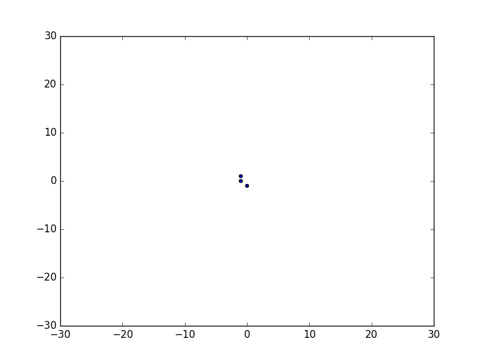

droplet
=======

Python toolkit for creating and manipulating diffusion limited aggregate structures. 

*Note that droplet is still in the early stages of development, support for the features and installation steps shown below will be added shortly.*

Features
--------

droplet is a Python based simulation suite which allows creation and manipulation of Diffusion Limited Aggregates (DLAs) in both real-time and otherwise. An incomplete featue list of droplet follows:

* Fast and accurate aggregate collision detection with support for varying stickiness structures
* Different lattice geometries such as square or triangular in both 2D and 3D
* Support for a variety of initial attractor seeds including points, circles and spheres
* Real-time visualisation of aggregate clustering using `matplotlib.animation`.
* Easy, single step installation via PyPI using: `pip install droplet`
* Fully open-source with all code available at https://github.com/SJR276/droplet
* No complicated dependencies required

Single-Step Installation
------------------------

Installation of droplet requires only a single step with pip::

    pip install droplet

Then you can execute a simple real-time droplet simulation, such as

.. code:: python

    import droplet as drp
    dla2d = drp.DiffusionLimitedAggregate2D()
    sim = drp.RealTimeAggregate2D(dla2d, nparticles=1000)

Examples
--------

The following simple case simulates a 2D DLA of 500 particles on a square-lattice in real-time, saving the animated plot to an output file:

.. code:: python

    import droplet as drp
    dla2d = drp.DiffusionLimitedAggregate2D()
    sim = drp.RealTimeAggregate2D(dla2d, nparticles=500, save=True,
                                  filename="../example_images/agg2dtest.gif")

This produces the animated scatter-chart shown below, where the colour gradient represents the order at which particles were added to the aggregate.

Statistics describing the generation of the aggregate can be tracked and plotted, the following example shows the number of lattice steps and boundary collisions experienced by each spawned Browian particle before it stuck to the aggregate.

.. code:: python

    import numpy as np
    import matplotlib.pyplot as plt
    import droplet as drp

    nparticles = 500
    aggregate = drp.DiffusionLimitedAggregate2D()
    aggregate.generate(nparticles)
    prange = np.arange(nparticles)
    fig = plt.figure()
    # dimensions of subplots for figure
    figdims = [(2,2,1), (2,2,3), (2,2,(2,4))]
    count = 0
    for nrows, ncols, plotno in figdims:
        sub = fig.add_subplot(nrows, ncols, plotno)
        # plot required steps for each particle
        if count == 0:
            sub.plot(prange, aggregate.required_steps)
            sub.set_xlabel('Aggregate Particle Index')
            sub.set_ylabel('Lattice Steps to Stick')
        # plot boundary collisions for each particle
        elif count == 1:
            sub.plot(prange, aggregate.boundary_collision, 'r')
            sub.set_xlabel('Aggregate Particle Index')
            sub.set_ylabel('Boundary Collisions')
        # plot aggregate itself
        else:
            sub.scatter(aggregate.x_coords, aggregate.y_coords, c=aggregate.colors)
            sub.set_xlabel('x')
            sub.set_ylabel('y')
        count += 1
    fig.savefig("../example_images/agg2dstats.png")

From this example, the figure below is produced.

